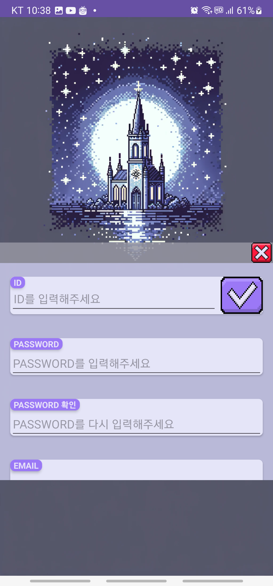

# 고해성사 다이어리 프로젝트

## 로그인
<table>
  <tr>
    <td></td>
    <td></td>
    <td></td>
     <td></td>
  </tr>
</table>

## 다이어리
<table>
  <tr>
    <td></td>
    <td></td>
    <td></td>
     <td></td>
     <td></td>
  </tr>
   
</table>

## 커뮤니티
<table>
  <tr>
    <td></td>
    <td></td>
    <td></td>
     <td></td>
  </tr>
   
</table>
